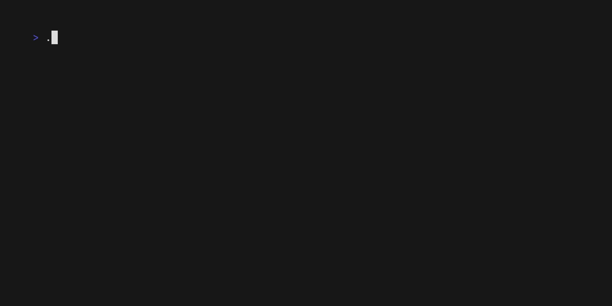

# zbar

A terminal spinner library for Zig featuring a collection of animated spinner styles.



## Spinner Styles

| Style | Preview |
|-------|---------|
| `classic` | `\ \| - /` |
| `arc` | `◜ ◠ ◝ ◞ ◡ ◟` |
| `braille` | `⠋ ⠙ ⠹ ⠸ ⠼ ⠴ ⠦ ⠧ ⠇ ⠏` |
| `clock` | `🕛 🕐 🕑 … 🕚` |
| `bouncing_ball` | `(●    ) ( ●   ) …` |
| `snake` | `▰▱▱▱▱ ▱▰▱▱▱ …` |
| `wave` | `▁ ▂ ▃ ▄ ▅ ▆ ▇ █ …` |
| `train` | `🚂🚃🚃🚃🚃 …` |

## Requirements

- [Zig](https://ziglang.org/) (latest master or a recent nightly build)

## Building

```sh
zig build
```

## Running

```sh
zig build run
```

This runs the demo in `main.zig`, which cycles through the `wave`, `train`, `bouncing_ball`, and `clock` styles, each running for 2 seconds.

## Usage

```zig
const spinner = @import("spinner.zig");

// Create and start a spinner
var s = spinner.Spinner.init(io, stdout, 120, .braille, "Loading...");
try s.start();

// Do some work...

// Stop and print a ✓ checkmark
try s.stop();
```

### `Spinner.init` parameters

| Parameter | Type | Description |
|-----------|------|-------------|
| `io` | `std.Io` | Io context |
| `writer` | `*std.Io.Writer` | Output writer |
| `interval_ms` | `i64` | Frame interval in milliseconds |
| `style` | `SpinnerStyle` | Spinner animation style |
| `message` | `[]const u8` | Message displayed next to the spinner |

### Lifecycle

- `start()` — spawns a background thread and begins animating
- `stop()` — signals the thread to stop, joins it, and prints `✓ <message>`

## Project Structure

```
.
├── build.zig
└── src/
    ├── main.zig       # Demo entry point
    ├── spinner.zig    # Spinner struct and SpinnerStyle enum
    └── ansi.zig       # ANSI escape helpers (clear line)
```

## License

MIT

